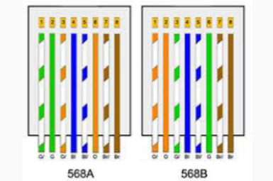

# Cableado estructurado

## Introducción

El cableado
&#x20;estructurado
&#x20;es:

Un método sistemático de cableado que cubre
&#x20;todas las necesidades de comunicación de los
\
usuarios
\
Concebido para distribuir la totalidad de las
&#x20;comunicaciones de la empresa, ya sean
&#x20;comunicaciones de voz, de imagen o de datos
\
Utiliza una jerarquía lógica en la que todo el
&#x20;cableado está adaptado a un único sistema
\
Es independiente de los protocolos y las
&#x20;aplicaciones que se utilizan.

Modular. El diseño de sus partes es independiente de la tecnología empleada y de los sistemas que se conectan a la red,
&#x20;independiente de la topología lógica de la red, ya que aunque la topología física del cableado estructurado es en estrella, es
&#x20;posible configurar otras topologías lógicas, ya sea en bus, en anillo, jerarquizada o en malla, por lo que sólo es necesario
&#x20;reconfigurar las conexiones centralizadas.
\
Ampliable. Las conexiones de nuevos sistemas terminales se hacen desde un punto centralizado hacia el
&#x20;nuevo sistema, no es necesario modificar ni el cableado ni las conexiones de los otros sistemas.
\
Flexible. Se pueden incorporar nuevos servicios, sin que interfieran con los antiguos.
\
Barato. En comparación con otros sistemas. Una vez realizada una instalación, cualquier ampliación no
&#x20;representa un coste adicional elevado y las actualizaciones no aumentan este coste.

### Ventajas del cableado estrucutrado

Facilidad de:

1. Ampliar para incluir servicios nuevos.
2. Cambiar su estructura inicial.
3. Mantenimiento tanto de las pequeñas modificaciones como de la implantación de nuevos sistemas y tecnologias. En la búsqueda de averías y la solución, ya que la mayor pueden localizar desde uno de los puntos de centralización.

<figure><figcaption></figcaption></figure>

<figure><figcaption></figcaption></figure>

## Subistemas del cableado

El cableado estructurado se divide en subsistemas que tienen funciones especificas:

* Sistema vertical: Formdo por todos los elementos necesario para enlazar los distribuidores de planta de un edificio.
* Sistema de cableado horizontal: Formaado por todos los elementos que permiten la conexión de los puestos de trabajo en el distribuidor de planta. Este subsistema puede existir o no, dependiendo, de la naturaleza y las dimensiones del sistema de cableado que se quiera instalar.

### Subsistemas del cableado estructurado

Acometida de comunicaciones (EF, entrance
&#x20;facility)
\
Es el punto por donde la red local se conecta con
&#x20;otras redes de comunicaciones externas.
\
Normalmente es la entrada de líneas de
&#x20;comunicación de datos, imagen o telefonía públicas y
&#x20;las líneas troncales de interconexión con redes de
&#x20;edificios vecinos.


\
Sala de equipamientos (ER, equipment room)
\
Es el punto donde están los sistemas que ofrecen
&#x20;servicios de comunicación, centralitas, servidores de
&#x20;conexión, servidores centrales, enrutadores de
&#x20;subred, es decir, todos los equipos relacionados
\
directamente con las comunicaciones.

Sala de comunicaciones: TR (telecommunications
&#x20;room)
-----------

Es donde está la distribución centralizada de una determinada área.
\
Suelen contener las terminaciones de los cables que van a otros
&#x20;armarios de distribución secundarios.
\
Pueden contener equipos de comunicación, concentradores o
&#x20;conmutadores.
\
Deben estar ubicados muy cerca del área a la que sirven. cuando la
&#x20;red se distribuye en varias plantas de un edificio o en varias salas
&#x20;fuerza pobladas de terminales, se recomienda un armario principal por
&#x20;planta o un armario para cada sala.

## Cableado troncal (backbone)

Comunicación entre las diferentes salas o armarios de telecomunicaciones, la sala de
&#x20;equipamientos o la conexión de servicio de comunicaciones y entre edificios vecinos.
\
Compuesto por las canalizaciones, armarios de conexiones intermedias y principales,
&#x20;paneles de interconexión y los medios instalados, cables, fibra óptica.
\
Enlazan:
\
• salas de acometida de diferentes edificios.
\
• la sala de acometida con la sala de equipamientos.
\
• la sala de equipamientos con los armarios o salas de telecomunicaciones, y éstas entre sí.

## Cableado de distribución

Comunica los armarios o salas de telecomunicaciones con
&#x20;los diferentes sistemas terminales de las áreas de trabajo.

Compuesto por las canalizaciones que llegan a la
&#x20;conexión de red fija (roseta), entre otros.


\
Estas conexiones se llaman enlaces permanentes, y
&#x20;suelen estar fijadas a la pared.

<figure><figcaption></figcaption></figure>

<figure><figcaption></figcaption></figure>

Pueden coexistir
&#x20;diferentes medios de
&#x20;red:

El cableado de distribución enlaces
&#x20;permanentes, para las redes más
&#x20;comunes, está formado por cables de
&#x20;par trenzado con conexiones RJ-45.
\
Para los troncales es frecuente el uso
&#x20;de la fibra óptica en sistemas de
&#x20;anchura de banda elevada.
\
Para instalaciones pequeñas (pocos
&#x20;sistemas o poco exigentes en ancho de
&#x20;banda) los troncales pueden ser
&#x20;también de cable de par trenzado o
&#x20;cable coaxial.
\
Para troncales entre edificios, es
&#x20;común el uso de cable coaxial grueso o
&#x20;de fibra óptica.

## Cableado estructurado

Para las canalizaciones tanto de los troncales como de la distribución,
&#x20;habitualmente se utilizan:
\
sistemas de bandejas portacables o canales decorativas de distribución,
&#x20;donde puede pasar el cableado, tanto de red como de imagen y telefonía.
\
Pueden coexistir, con la separación adecuada, con el cableado de la
&#x20;alimentación eléctrica.
\
Se pueden ubicar en estos canales los mecanismos como las rosetas de
&#x20;conexión de red o los enchufes de corriente, lo que facilita la instalación
&#x20;del cableado y la ampliación.

## Armario o rack

De altura variable.
\
Depende de la
&#x20;cantidad de hardware
&#x20;que deseemos
&#x20;albergar
&#x20;(servidor, SAI, Router,
&#x20;matriz de discos,
&#x20;unidades para copias
&#x20;de seguridad).
\
Permiten guardar
&#x20;también el teclado y el
&#x20;monitor del servidor.

La altura debe contar con la suma en
&#x20;unidades de los equipos a instalar más el
&#x20;espacio dedicado a paneles de gestión del
&#x20;cableado y siempre que sea posible dejar
&#x20;un espacio libre extra del 25% para futuras
&#x20;ampliaciones o modificaciones.
\
Por conseguir mayor limpieza y salida del
&#x20;calor.
\
Si no conocemos los equipos que se van a
&#x20;instalar, y siempre que no haya
&#x20;limitaciones de altura, la recomendación
&#x20;general es elegir un rack alto, esto es de
&#x20;42U en general, que es la medida más
\
utilizada.

<figure><figcaption></figcaption></figure>

## Cuarto de comunicaciones

Área física destinada al
&#x20;alojamiento de los
&#x20;elementos que
&#x20;conforman el sistema
&#x20;de telecomunicaciones.
\
Se encuentran
&#x20;conmutadores y todos
&#x20;los elementos
&#x20;centralizados que
&#x20;corren a través de
\
tramos horizontales
&#x20;hasta el área de
\
trabajo.
\
La complejidad de su
&#x20;montaje es la mayor
&#x20;de toda la red.
\
Cada planta del edificio
&#x20;debe contar con una
&#x20;habitación de este tipo.

Temperatura ambiente debe encontrarse entre 18 y 24 °C
\
La humedad entre 30% y 50%.
\
Debe encontrarse en un lugar sin riesgo de inundación o en contacto con agua.
\
En caso de haber riesgo de ingreso de agua, se debe proporcionar drenaje de
&#x20;piso.
\
No puede compartir espacio con instalaciones eléctricas que no estén
&#x20;relacionadas con las telecomunicaciones.

## Rosetas y tomas de usuarios

Tienen forma de caja en las que se encuentra el
&#x20;jack (dispositivo usado para conectar redes de
&#x20;cableado estructurado)
\
Se colocan en la pared

<figure><figcaption></figcaption></figure>

## Etiquetado de los cables

Importante realizar el correcto etiquetado de los cables
&#x20;en sus extremos.
\
Identificar cada PC y cada toma de conexión y usar la
&#x20;misma nomenclatura para los cables que se conectan
&#x20;a ella, tanto en el extremo de la toma como en el otro.
\
El etiquetado depende de nosotros o de la política de
&#x20;nuestra empresa.

En general:
\
Rojo: la red de Wi-Fi y DMZ.
\
Blanco: teléfono analógico.
\
Amarillo: panel de parcheo (entre el interruptor y el panel de conexiones).
\
Azul: servidores.
\
Verde: interconexiones de switch.
\
Naranja: telecomunicaciones
\
Negro: copia de seguridad

<figure><figcaption></figcaption></figure>

## LINKS





